# Лабораторная работа 4

## Скриншот базы данных
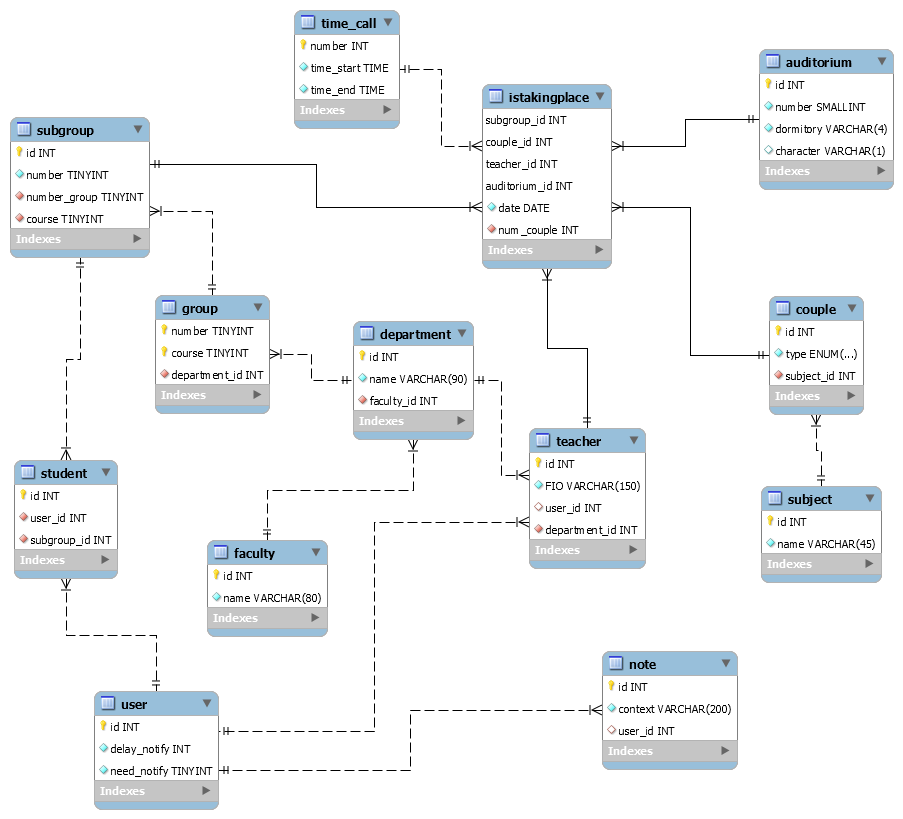
## Собственные запросы

### Транзакционные
1. Добавить себя в студента/преподавателя

*Вставляем данные в таблицу*

```mysql
INSERT INTO student(user_id,subgroup_id) VALUE(95824080,6);
```

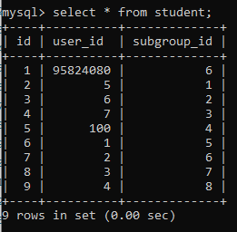

2. *Добавляем преподавателю* *user**_**id*

```mysql
UPDATE `teacher` SET `user_id` = '95824080' WHERE (`FIO` = 'Литовкин Дмитрий Васильевич');
```


3. Удалить себя из студента/преподавателя:

   *Удаляем* *user_id*

   ```mysql
   DELETE FROM `student` WHERE (`user_id` = '95824080');
   ```

   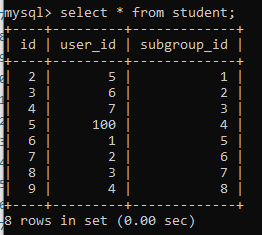

   

4. Добавить заметку 

   *Добавляем в таблицу заметок значения*

   ```mysql
   INSERT INTO note(context,user_id) VALUE('это',1);
   ```

   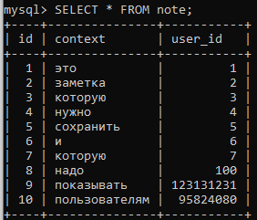

5. Удалить заметку

   *Удаляем заметку данного пользователя с этим содержимым*

   ```mysql
   DELETE FROM `note` WHERE (`user_id`=1 AND `context`= `это`); 
   ```

   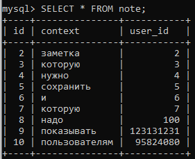

6. Выбрать группу и подгруппу

   *Задаем для студента подгруппу по его группе, курсу и номеру подругппы*

   ```mysql
   UPDATE student SET subgroup_id = ( SELECT id FROM subgroup WHERE(number_group = 66 and course = 3 and number = 0)) WHERE (user_id = 95824080);
   
   ```

   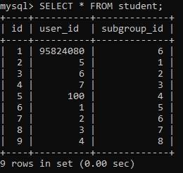

### Справочные

7. Показать расписание на сегодня/завтра/выбранный день

   *Показать дату, время, тип и название предмета, зная* *user**_**id* *и дату*

   ```mysql
   SELECT `date`,`num_couple`,`type`,`name` as `subject`
   FROM couple 
   JOIN `subject` ON `subject`.`id` = `couple`.`subject_id` 
   JOIN `istakingplace` on `istakingplace`.`couple_id` =`couple`.`id` 
   JOIN `subgroup` on `istakingplace`.`subgroup_id` = `subgroup`.`id`
   JOIN `student` on `student`.`subgroup_id` = `subgroup`.`id`
   WHERE (`user_id`=95824080 AND `date` = "2020-11-20");
   ```

   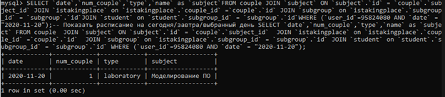

8. Показать расписание другой группы

   *Зная группу и курс, узнаем* *id* *подгруппы*

   ```mysql
   SELECT
      date,num_couple, type, name AS subject
   FROM
       subgroup
   JOIN istakingplace ON istakingplace.subgroup_id = subgroup.id
   JOIN couple ON couple.id = istakingplace.couple_id
   JOIN subject ON subject.id = couple.subject_id
   WHERE number_group = 66 AND course = 3;
   ```

   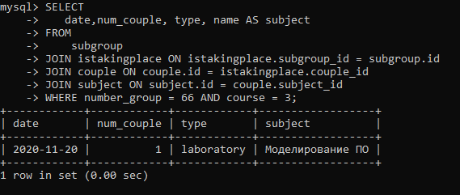

9. Показать расписание преподавателя

   *Достаем по ФИО преподавателя* *id*, и ищем пары среди проводимых, выводим дату, время, тип и название пары*

   ```mysql
   SELECT `date`,`num_couple`,`type`,`name` as `subject`
   FROM couple 
   JOIN `subject` ON `subject`.`id` = `couple`.`subject_id` 
   JOIN `istakingplace` on `istakingplace`.`couple_id` =`couple`.`id` 
   JOIN `teacher` on `istakingplace`.`teacher_id` = `teacher`.`id`
   WHERE (FIO = "Литовкин Дмитрий Васильевич"  AND `date` = "2020-11-02"); 
   ```

   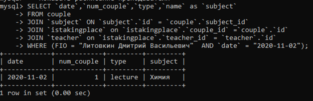

10. Показать расписание на неделю
	
	```mysql
	SELECT * FROM shedule.istakingplace WHERE (`date` between 20201102 and 20201102 + interval 1 week);
	```
	
	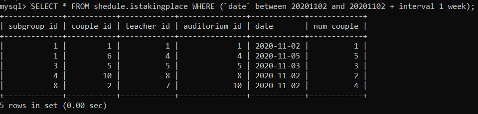

   ### Справочно-расчетные

11. Показать среднее количество пар в день

    *Получаем все пары этого преподавателя, затем считаем количество пар в неделю, складываем и делим на 7*

    ```mysql
    SELECT SUM(`count`)/7.0 as `avg`
    FROM (SELECT COUNT(`name`) as `count`
    	  FROM couple 
    	  JOIN `subject` ON `subject`.`id` = `couple`.`subject_id` 
    	  JOIN `istakingplace` on `istakingplace`.`couple_id` =`couple`.`id` 
    	  JOIN `teacher` on `istakingplace`.`teacher_id` = `teacher`.`id`
    	  WHERE ( FIO = "Литовкин Дмитрий Васильевич" AND `date` BETWEEN 20201028 AND date_add(20201028,INTERVAL 7 DAY))
          GROUP BY `date`) as `count_couple_in_day`;
    ```

    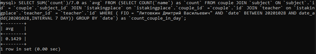

12. Показать количество пройденных пар сегодня

    *Из преподавателя достает айди, ищет пары, которые должен вести преподаватель, проверяется дата и время и считается их количество* 

    ```mysql
    SELECT COUNT(*)
    FROM couple 
    JOIN `subject` ON `subject`.`id` = `couple`.`subject_id` 
    JOIN `istakingplace` on `istakingplace`.`couple_id` =`couple`.`id` 
    JOIN `teacher` on `istakingplace`.`teacher_id` = `teacher`.`id`
    JOIN `time_call` on `time_call`.`number` = `istakingplace`.`num_couple`
    WHERE ( FIO = "Литовкин Дмитрий Васильевич"  AND `date`=20201102 /*current_date()*/ AND `time_end`<= 100000 /*current_time()*/);
    ```
    
    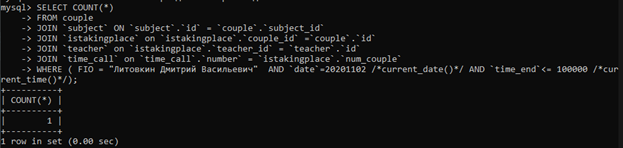
    
13. Показать количество студентов в группе/кафедре/факультете

    *Получаем группу и курс и считаем количество* 

    ```mysql
    SELECT COUNT(*) as `count` FROM shedule.group WHERE ( (course,number) = (3,63) );
    ```

    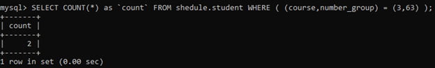
    
14. Показать все пары по предмету

    *Выбираем предметы, которые совпадают по названию*

    ```mysql
    SELECT date,num_couple,type FROM shedule.couple 
    JOIN subject ON subject.id = couple.subject_id
    JOIN `istakingplace` on `istakingplace`.`couple_id` =`couple`.`id`
    WHERE (`name` = "Базы данных"); 
    ```

    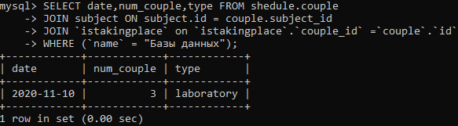

15. Показать аудитории, в которых отсутствует пары в заданное время

     *Узнаем, какие пары есть в текущую дату и время, узнаем какие аудитории занимают и исключаем при отображении всех аудиторий*

    ```mysql
    SELECT `number`,`dormitory`,`character` FROM auditorium WHERE (id NOT IN (
    SELECT auditorium_id FROM shedule.istakingplace
    JOIN `time_call` on `time_call`.`number` = `istakingplace`.`num_couple`
    WHERE (date = 20201102 and 090000 between time_start and time_end)));
    ```

    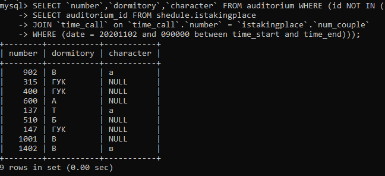

## INSERTы для своей БД или БД одногруппника из предыдущей лабораторной работы (10 шт.+)

[Скрипт](https://github.com/Aioki/db_bot/blob/main/add_temp_value.sql)

Скриншоты результатов см предыдущую работу


## UPDATE (с WHERE) (7 шт.), можно условно, например, изменить заранее созданные некорректные данные


## DELETE с WHERE (5 шт.), можно условно, например, удалить заранее созданные некорректные данные

## SELECT, DISTINCT, WHERE, AND/OR/NOT, IN, BETWEEN, IS NULL, AS (25 шт.)

## LIKE (5-7 шт.)

## COUNT, MAX, MIN, SUM, AVG (10 шт.)

## GROUP BY, HAVING (7 шт.)

## ORDER BY, ASC|DESC (7 шт. +)


1. ```mysql
   SELECT * FROM `group` ORDER BY `course`;
   ```

   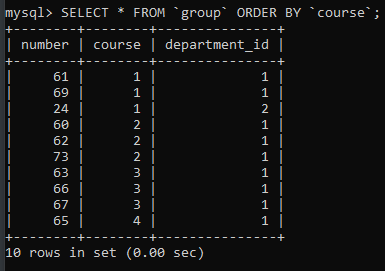

2. ```mysql
   SELECT * FROM `group` ORDER BY `number` DESC;
   ```

   

3. ```mysql
   SELECT * FROM `auditorium`  ORDER BY `dormitory`,`number`,`character`;
   ```

   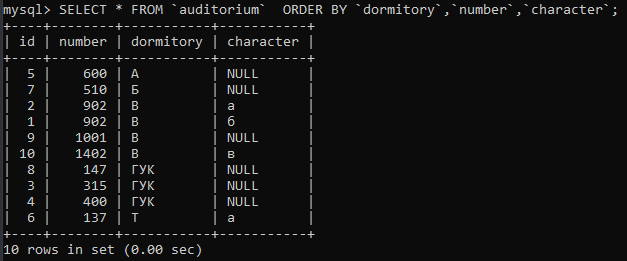

4. ```mysql
   SELECT * FROM department ORDER BY faculty_id;
   ```

   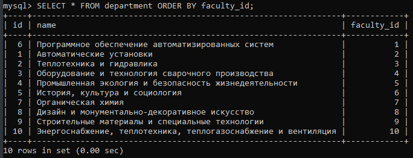

5. ```mysql
   SELECT * FROM couple ORDER BY `type`;
   ```

   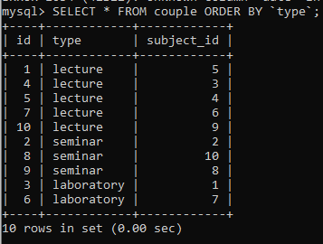

6. ```mysql
   SELECT * FROM subject ORDER BY `name` DESC;
   ```

   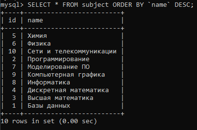

7. ```mysql
   SELECT * FROM user ORDER BY `delay_notify` DESC;
   ```

   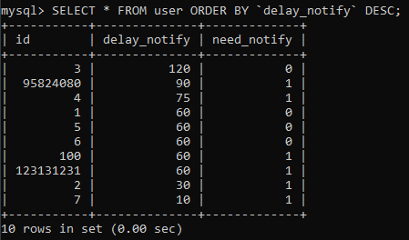
   
## Вложенные SELECTы (3 шт.)

1. ```mysql
   SELECT delay_notify FROM user WHERE ( id IN (SELECT `user_id` FROM shedule.student ) AND need_notify = 1);
   ```

   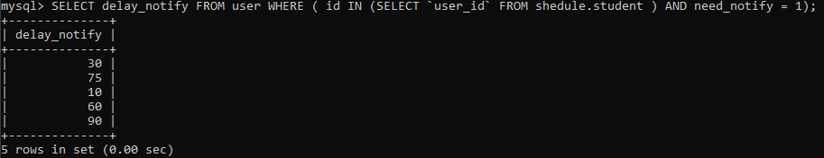

2. ```mysql
   SELECT `type` FROM couple WHERE (subject_id IN (SELECT id FROM subject WHERE(`name` = "Химия")));
   ```

   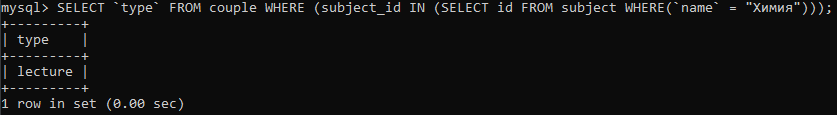

   

## SELECT INTO (1-2 шт.), можно в какую-то тестовую, специально созданную таблицу

## INSERT SELECT (1-2 шт.), можно в какую-то тестовую, специально созданную таблицу

## UNION (ALL), EXCEPT, INTERCEPT какой-то из них на выбор (2-3 шт.)

## JOIN (20 шт.): INNER, OUTTER (LEFT, RIGHT, FULL), CROSS, NATURAL, в общем, разных

## LIMIT (5 шт. +)

1. ```mysql
   SELECT * FROM `group` ORDER BY `course` LIMIT 2;
   ```

   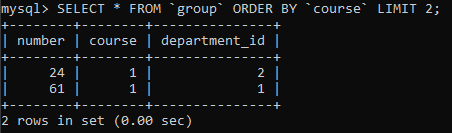

2. ```mysql
   SELECT * FROM `note` LIMIT 5;
   ```

   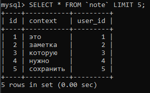

3. ```mysql
   SELECT * FROM `teacher` LIMIT 8;
   ```

   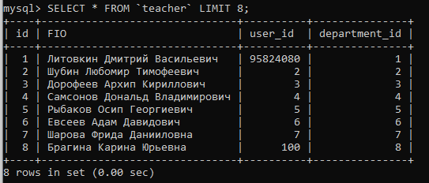

4. ```mysql
   SELECT * FROM `auditorium`  ORDER BY `dormitory`,`number`,`character` LIMIT 3;
   ```

   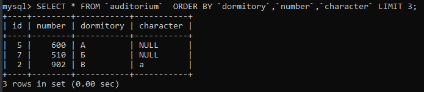

5. ```mysql
   SELECT * FROM couple LIMIT 1;
   ```

   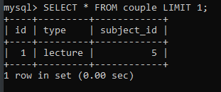
