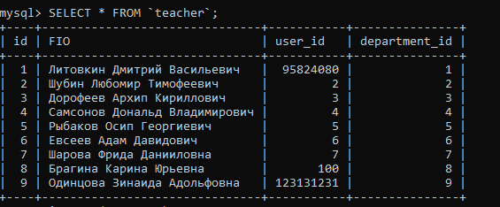
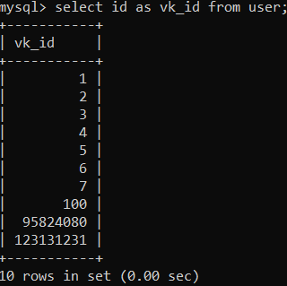
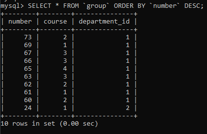

# Лабораторная работа 4

## Скриншот базы данных

## Собственные запросы

### Транзакционные
1. Добавить себя в студента/преподавателя

*Вставляем данные в таблицу*

```mysql
INSERT INTO student(user_id,subgroup_id) VALUE(95824080,6);
```


2. *Добавляем преподавателю* *user**_**id*

```mysql
UPDATE `teacher` SET `user_id` = '95824080' WHERE (`FIO` = 'Литовкин Дмитрий Васильевич');
```



3. Удалить себя из студента/преподавателя:

   *Удаляем* *user_id*

   ```mysql
   DELETE FROM `student` WHERE (`user_id` = '95824080');
   ```

   

   

4. Добавить заметку 

   *Добавляем в таблицу заметок значения*

   ```mysql
   INSERT INTO note(context,user_id) VALUE('это',1);
   ```

   

5. Удалить заметку

   *Удаляем заметку данного пользователя с этим содержимым*

   ```mysql
   DELETE FROM `note` WHERE (`user_id`=1 AND `context`= `это`); 
   ```

   

6. Выбрать группу и подгруппу

   *Задаем для студента подгруппу по его группе, курсу и номеру подругппы*

   ```mysql
   UPDATE student SET subgroup_id = ( SELECT id FROM subgroup WHERE(number_group = 66 and course = 3 and number = 0)) WHERE (user_id = 95824080);
   
   ```

   

### Справочные

7. Показать расписание на сегодня/завтра/выбранный день

   *Показать дату, время, тип и название предмета, зная* *user**_**id* *и дату*

   ```mysql
   SELECT `date`,`num_couple`,`type`,`name` as `subject`
   FROM couple 
   JOIN `subject` ON `subject`.`id` = `couple`.`subject_id` 
   JOIN `istakingplace` on `istakingplace`.`couple_id` =`couple`.`id` 
   JOIN `subgroup` on `istakingplace`.`subgroup_id` = `subgroup`.`id`
   JOIN `student` on `student`.`subgroup_id` = `subgroup`.`id`
   WHERE (`user_id`=95824080 AND `date` = "2020-11-20");
   ```

   

8. Показать расписание другой группы

   *Зная группу и курс, узнаем* *id* *подгруппы*

   ```mysql
   SELECT
      date,num_couple, type, name AS subject
   FROM
       subgroup
   JOIN istakingplace ON istakingplace.subgroup_id = subgroup.id
   JOIN couple ON couple.id = istakingplace.couple_id
   JOIN subject ON subject.id = couple.subject_id
   WHERE number_group = 66 AND course = 3;
   ```

   

9. Показать расписание преподавателя

   *Достаем по ФИО преподавателя* *id*, и ищем пары среди проводимых, выводим дату, время, тип и название пары*

   ```mysql
   SELECT `date`,`num_couple`,`type`,`name` as `subject`
   FROM couple 
   JOIN `subject` ON `subject`.`id` = `couple`.`subject_id` 
   JOIN `istakingplace` on `istakingplace`.`couple_id` =`couple`.`id` 
   JOIN `teacher` on `istakingplace`.`teacher_id` = `teacher`.`id`
   WHERE (FIO = "Литовкин Дмитрий Васильевич"  AND `date` = "2020-11-02"); 
   ```

   

10. Показать расписание на неделю
	
	```mysql
	SELECT * FROM shedule.istakingplace WHERE (`date` between 20201102 and 20201102 + interval 1 week);
	```
	


   ### Справочно-расчетные

11. Показать среднее количество пар в день

    *Получаем все пары этого преподавателя, затем считаем количество пар в неделю, складываем и делим на 7*

    ```mysql
    SELECT SUM(`count`)/7.0 as `avg`
    FROM (SELECT COUNT(`name`) as `count`
    	  FROM couple 
    	  JOIN `subject` ON `subject`.`id` = `couple`.`subject_id` 
    	  JOIN `istakingplace` on `istakingplace`.`couple_id` =`couple`.`id` 
    	  JOIN `teacher` on `istakingplace`.`teacher_id` = `teacher`.`id`
    	  WHERE ( FIO = "Литовкин Дмитрий Васильевич" AND `date` BETWEEN 20201028 AND date_add(20201028,INTERVAL 7 DAY))
          GROUP BY `date`) as `count_couple_in_day`;
    ```

    

12. Показать количество пройденных пар сегодня

    *Из преподавателя достает айди, ищет пары, которые должен вести преподаватель, проверяется дата и время и считается их количество* 

    ```mysql
    SELECT COUNT(*)
    FROM couple 
    JOIN `subject` ON `subject`.`id` = `couple`.`subject_id` 
    JOIN `istakingplace` on `istakingplace`.`couple_id` =`couple`.`id` 
    JOIN `teacher` on `istakingplace`.`teacher_id` = `teacher`.`id`
    JOIN `time_call` on `time_call`.`number` = `istakingplace`.`num_couple`
    WHERE ( FIO = "Литовкин Дмитрий Васильевич"  AND `date`=20201102 /*current_date()*/ AND `time_end`<= 100000 /*current_time()*/);
    ```
    
    
    
13. Показать количество студентов в группе/кафедре/факультете

    *Получаем группу и курс и считаем количество* 

    ```mysql
    SELECT COUNT(*) as `count` FROM shedule.group WHERE ( (course,number) = (3,63) );
    ```

    
    
14. Показать все пары по предмету

    *Выбираем предметы, которые совпадают по названию*

    ```mysql
    SELECT date,num_couple,type FROM shedule.couple 
    JOIN subject ON subject.id = couple.subject_id
    JOIN `istakingplace` on `istakingplace`.`couple_id` =`couple`.`id`
    WHERE (`name` = "Базы данных"); 
    ```

    

15. Показать аудитории, в которых отсутствует пары в заданное время

     *Узнаем, какие пары есть в текущую дату и время, узнаем какие аудитории занимают и исключаем при отображении всех аудиторий*

    ```mysql
    SELECT `number`,`dormitory`,`character` FROM auditorium WHERE (id NOT IN (
    SELECT auditorium_id FROM shedule.istakingplace
    JOIN `time_call` on `time_call`.`number` = `istakingplace`.`num_couple`
    WHERE (date = 20201102 and 090000 between time_start and time_end)));
    ```

    

## INSERTы для своей БД или БД одногруппника из предыдущей лабораторной работы (10 шт.+)

[Скрипт](https://github.com/Aioki/db_bot/blob/main/add_temp_value.sql)

Скриншоты результатов см предыдущую работу

## UPDATE (с WHERE) (7 шт.), можно условно, например, изменить заранее созданные некорректные данные

1. ```mysql
   UPDATE `teacher` SET `user_id` = NULL WHERE (`id` = '1');
   ```

   

2. UPDATE `shedule`.`istakingplace` SET `auditorium_id` = '2' WHERE (`subgroup_id` = '5') and (`couple_id` = '4') and (`teacher_id` = '3') and (`auditorium_id` = '7');
   UPDATE `shedule`.`istakingplace` SET `auditorium_id` = '3' WHERE (`subgroup_id` = '6') and (`couple_id` = '6') and (`teacher_id` = '9') and (`auditorium_id` = '9');
   
3. UPDATE `shedule`.`istakingplace` SET `num_couple` = '1' WHERE (`subgroup_id` = '1') and (`couple_id` = '7') and (`teacher_id` = '2') and (`auditorium_id` = '3');
   UPDATE `shedule`.`istakingplace` SET `num_couple` = '3' WHERE (`subgroup_id` = '4') and (`couple_id` = '10') and (`teacher_id` = '8') and (`auditorium_id` = '8');


## DELETE с WHERE (5 шт.), можно условно, например, удалить заранее созданные некорректные данные

## SELECT, DISTINCT, WHERE, AND/OR/NOT, IN, BETWEEN, IS NULL, AS (25 шт.)
1. ```mysql
   select * from time_call;
   ```
   
   

2. ```mysql
   select * from time_call where (090000 between time_start and time_end);
   ```
   
   

3. ```mysql
   select name from department;
   ```
   
   

4. ```mysql
   select * from `group` where (number between 60 and 67);
   ```
   
   

5. ```mysql
   select distinct date from istakingplace;select distinct delay_notify from user;
   ```
   
   

6. ```mysql
   select distinct delay_notify from user;
   ```
   
   

7. ```mysql
   select number,course from `group` where(course >= 3);
   ```
   
   

8. ```mysql
   select dormitory,number,`character` from auditorium where (dormitory = "В");
   ```
   
   

9. ```mysql
   select * from `group` where (number = 66 and course = 3);
   ```
   
   

10. ```mysql
    select id from user where (need_notify = 1 and delay_notify = 60);
    ```
    
    

11. ```mysql
    select id from department where (faculty_id = 6 or faculty_id = 1);
    ```
    
    

12. ```mysql
    select number from time_call where(time_start = 114000 or time_start =115000);
    ```
    
    

13. ```mysql
    select dormitory,number,`character` from auditorium where not dormitory = "В";
    ```
    
    

14. ```mysql
    select * from `group` where not (number = 66 and course = 3);
    ```
    
    

15. ```mysql
    select * from teacher where(user_id is null);
    ```
    
    

16. ```mysql
    select number,dormitory from auditorium where(`character` is null);
    ```
    
    

17. ```mysql
    SELECT `department`.`name` as `depart_name`, `faculty`.`name` as `faculty_name` FROM department 
    JOIN faculty on department.faculty_id = faculty.id;
    ```
    


    
18. ```mysql
    select id as vk_id from user;
    ```
    
    

19. ```mysql
    select FIO from teacher where(department_id in (6,8,9));
    ```
    
    

20. ```mysql
    select id from user where (delay_notify in (60,10,120));
    ```
    
    


## LIKE (6 шт.+)

1. ```mysql
   select * from teacher where FIO like '%Дмитр%';
   ```
   
   

2. ```mysql
   SELECT * from faculty where name like '%трансп%';
   ```
   
   

3. ```mysql
   select * from note where context like '___';
   ```
   
   

4. ```mysql
   select * from auditorium where dormitory like '_';
   ```
   
   

5. ```mysql
   select * from teacher where FIO like '%вна';
   ```
   
   

6. ```mysql
   SELECT * from faculty where name like 'техно%';
   ```
   
   


## COUNT, MAX, MIN, SUM, AVG (10 шт. +)

1. ```mysql
   select need_notify, count(*) as count from user group by need_notify;
   ```

   

2. ```mysql
   select count(*) as has_account from teacher where user_id >= 1;
   ```

   

3. ```mysql
   select max(num_couple) as last_couple from istakingplace where date = 20201102;
   ```

   

4. ```mysql
   select min(num_couple) as last_couple from istakingplace where date = 20201102;
   ```

   

5. ```mysql
   select max(delay_notify) from user;
   ```

   

6. ```mysql
   select min(delay_notify) from user where delay_notify>0;
   ```

   

7. ```mysql
   SELECT date, COUNT(`name`) as `count`
   	  FROM couple 
   	  JOIN `subject` ON `subject`.`id` = `couple`.`subject_id` 
   	  JOIN `istakingplace` on `istakingplace`.`couple_id` =`couple`.`id` 
   	  JOIN `teacher` on `istakingplace`.`teacher_id` = `teacher`.`id`
   	  WHERE ( `date` BETWEEN 20201028 AND date_add(20201028,INTERVAL 7 DAY))
         GROUP BY `date`;
   ```

   

8. ```mysql
   select delay_notify, count(*) as count from user group by delay_notify order by delay_notify;
   ```

   

9. ```mysql
   select avg(count) from (select delay_notify, count(*) as count from user group by delay_notify) as count_table;
   ```

   

10. ```mysql
    select dormitory, count(*) as count from auditorium group by dormitory order by dormitory;
    ```

    

    

## GROUP BY, HAVING (4 шт.+)

1. ```mysql
   select type, count(*) from couple group by type;
   ```

   

2. ```mysql
   select * from istakingplace group by num_couple;
   ```

   

3. ```mysql
   select * from user group by need_notify having max(delay_notify);
   ```

   

4. ```mysql
   select * from `group` group by number having max(course);
   ```

   

## ORDER BY, ASC|DESC (7 шт. +)


1. ```mysql
   SELECT * FROM `group` ORDER BY `course`;
   ```

   

2. ```mysql
   SELECT * FROM `group` ORDER BY `number` DESC;
   ```

   

3. ```mysql
   SELECT * FROM `auditorium`  ORDER BY `dormitory`,`number`,`character`;
   ```

   

4. ```mysql
   SELECT * FROM department ORDER BY faculty_id;
   ```

   

5. ```mysql
   SELECT * FROM couple ORDER BY `type`;
   ```

   

6. ```mysql
   SELECT * FROM subject ORDER BY `name` DESC;
   ```

   

7. ```mysql
   SELECT * FROM user ORDER BY `delay_notify` DESC;
   ```

   
   
## Вложенные SELECTы (3 шт. +)

1. ```mysql
   SELECT delay_notify FROM user WHERE ( id IN (SELECT `user_id` FROM shedule.student ) AND need_notify = 1);
   ```

   

2. ```mysql
   SELECT `type` FROM couple WHERE (subject_id IN (SELECT id FROM subject WHERE(`name` = "Химия")));
   ```

   
   
3. ```mysql
   SELECT name FROM department WHERE ( faculty_id in (
       SELECT id FROM faculty WHERE(name = "Электроники и Вычислительной техники")) );
   ```
   
   

## SELECT INTO (2 шт. +), можно в какую-то тестовую, специально созданную таблицу

1. ```mysql
   -- create template table
   create table newtable select * from teacher where id <6;
   ```

   

2. ```mysql
   create table temptable select * from user where 1 = 0;
   ```

   

## INSERT SELECT (2 шт.+), можно в какую-то тестовую, специально созданную таблицу

1. ```mysql
   INSERT INTO temptable select * from user where delay_notify = 60;
   ```

   

2. ```mysql
   INSERT INTO newtable select * from teacher where id = 9;
   ```

   

   

## UNION (ALL), EXCEPT, INTERCEPT какой-то из них на выбор (1 шт.+)

1. ```mysql
   SELECT id,name from department
   UNION ALL
   SELECT * from faculty;
   ```

   

## JOIN (15 шт.+): INNER, OUTTER (LEFT, RIGHT, FULL), CROSS, NATURAL, в общем, разных

1. ```mysql
   SELECT FIO as teacher_name, date, type, dormitory,number,`character` from istakingplace 
   JOIN `teacher` on `istakingplace`.`teacher_id` = `teacher`.`id`
   JOIN couple ON couple.id = istakingplace.couple_id
   RIGHT JOIN auditorium on istakingplace.auditorium_id = auditorium.id;
   ```
   
   
   
2. ```mysql
   SELECT `department`.`name` as `depart_name`, `faculty`.`name` as `faculty_name` FROM department 
   CROSS JOIN faculty;
   ```
   
   
   
3. ```mysql
   SELECT user_id, course, number_group from student
   JOIN subgroup on student.subgroup_id = subgroup.id;
   ```


4. ```mysql
   SELECT subgroup.number, subgroup.course,`group`.number FROM shedule.subgroup
   RIGHT JOIN `group` on subgroup.number_group = `group`.`number` and subgroup.course = `group`.course;
   ```
   


5. ```mysql
   select * from time_call LEFT join istakingplace on number = istakingplace.num_couple;
   ```
   
   

6. ```mysql
   SELECT user.id, FIO FROM shedule.user 
   LEFT JOIN teacher on user.id = teacher.user_id;
   ```
   


7. ```mysql
   SELECT name as couple, type, `date` FROM shedule.couple
   JOIN subject ON subject.id = couple.subject_id
   LEFT JOIN istakingplace on couple.id = istakingplace.couple_id;
   ```

   
   
8. ```mysql
   SELECT type,name,`subgroup`.`number` as subgroup,date FROM shedule.istakingplace
   JOIN couple ON couple.id = istakingplace.couple_id
   JOIN subject ON subject.id = couple.subject_id
   JOIN `subgroup` on `istakingplace`.`subgroup_id` = `subgroup`.`id`;
   ```
   
   
   
9. ```mysql
   SELECT * FROM shedule.couple
   NATURAL JOIN subject;
   ```
   


10. ```mysql
    SELECT * FROM shedule.department
    NATURAL JOIN teacher;
    ```

    
    
11. ```mysql
    SELECT * FROM user
    LEFT JOIN note on user.id = note.user_id;
    ```
    
    
    
12. ```mysql
    select name,type from couple
    join subject on subject_id = subject.id;
    ```
    

    
    
13. ```mysql
    SELECT FIO, faculty.name as faculty from teacher
    join department on department_id = department.id
    join faculty on faculty_id = faculty.id;
    ```

    
    
14. ```mysql
    SELECT date,time_start from istakingplace
    join time_call on num_couple = number;
    ```
    

    
    
15. ```mysql
    SELECT course,number_group,number as subgroup, FIO from subgroup
    JOIN istakingplace on subgroup.id = istakingplace.subgroup_id
    JOIN `teacher` on `istakingplace`.`teacher_id` = `teacher`.`id`;
    ```

    
    


## LIMIT (5 шт. +)

1. ```mysql
   SELECT * FROM `group` ORDER BY `course` LIMIT 2;
   ```

   

2. ```mysql
   SELECT * FROM `note` LIMIT 5;
   ```

   

3. ```mysql
   SELECT * FROM `teacher` LIMIT 8;
   ```

   

4. ```mysql
   SELECT * FROM `auditorium`  ORDER BY `dormitory`,`number`,`character` LIMIT 3;
   ```

   

5. ```mysql
   SELECT * FROM couple LIMIT 1;
   ```

   
